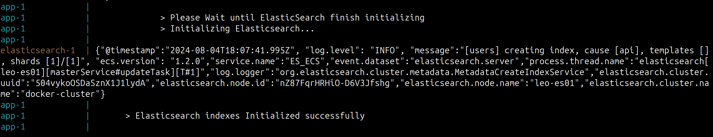

# Leo User Api
Rest Api to create user with role.
- Nodejs + Express.js + Typescript + Elasticsearch

-- elasticsearch authentication has been disabled for development 


### script 

```sh
npm install
# run development 
npm run dev
# build production
npm run build

# run test
npm run test
# test watch
npm run test:wa 

# run application with docker compose
docker compose up

```
Server Address :[http://localhost:8000](http://localhost:8000)

After Running application please wait until elasticsearch initializing finished.
your terminal will return following logs if it successful : 


```
> Please Wait until ElasticSearch finish initializing
> Initializing Elasticsearch...
> Elasticsearch indexes Initialized successfully   
```
if it failed it returns error logs.

### Api Documents

please load api documentation in your Postman app `./doc/LeoVegas-Api.postman_collection.json`

## More Details 
- each service layer has specific directory